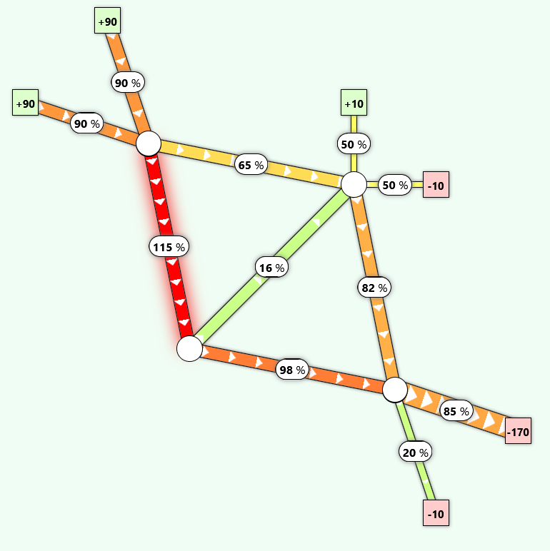

# grid-congestion-game

> ***This project is a work in progress***

This is a small game about managing grid congestion, written in Vue/TypeScript and destined to run as a standalone in a browser.

While trying to stay true to real-world concepts, the models and solver take shortcuts and make simplifications, and the results accuracy is not guaranteed.

[> Deployed on GitHub pages <](https://ALambot.github.io/grid-congestion-game/)

## Project structure

### src/models

Contains type definitions, utils, and the powerflow solver code `(src/models/solver.ts)`

### src/levels

Contains instances of grid input configurations, used by the solver and UI

### scr/components

Contains UI components

## Setup

1. Install [Node.js](https://nodejs.org/en/download)
2. `npm install`
3. `npm run dev`

## License
This project is currently unlicensed.  
You may view the source code, but copying, modifying, or redistributing it is not permitted without explicit permission.
